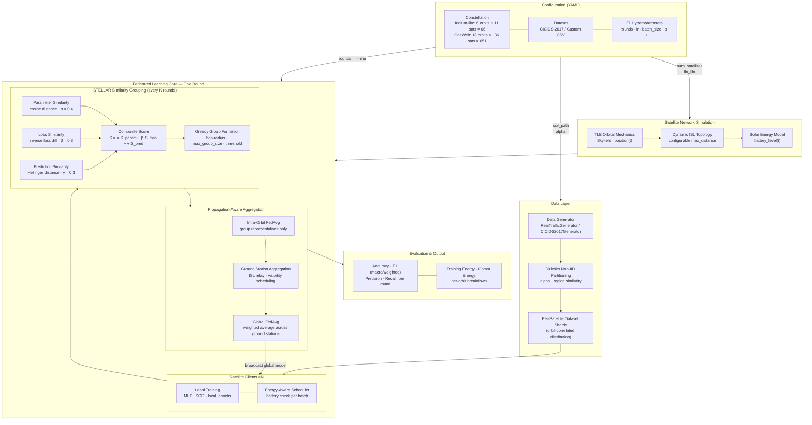

# STELLAR: Similarity-Based Satellite Federated Learning for Malicious Traffic Recognition

> **Published in:** IEEE Transactions on Information Forensics and Security, vol. 21, pp. 1766–1780, 2026.
> DOI: [10.1109/TIFS.2026.3659044](https://doi.org/10.1109/TIFS.2026.3659044)

[[中文文档]](README_zh.md)

STELLAR is a federated learning framework for LEO satellite constellation networks, targeting **malicious traffic recognition (intrusion detection)**. It proposes a **multi-dimensional similarity-based grouping** strategy that clusters satellites by model parameter similarity, loss landscape similarity, and prediction distribution similarity, enabling efficient intra-orbit collaborative training while adapting to the highly dynamic and resource-constrained satellite environment.

## System Architecture



## Overview

Traditional federated learning algorithms (FedAvg, FedProx) are designed for terrestrial networks and do not account for the unique characteristics of satellite networks:

- Intermittent and topology-changing inter-satellite links (ISLs)
- Heterogeneous non-IID data distributions across orbital planes
- Strict energy budgets driven by solar harvesting cycles
- High communication latency between satellites and ground stations

STELLAR addresses these challenges through:

1. **Similarity-based satellite grouping** — satellites are clustered by a composite similarity score combining parameter distance, loss divergence, and prediction agreement
2. **Propagation-constrained aggregation** — model updates propagate only within reachable hops, respecting link availability
3. **Energy-aware scheduling** — training and transmission are gated by real-time battery level estimates based on orbital solar exposure

## Repository Structure

```
stellar/
├── configs/                    # Experiment configuration files (YAML)
│   ├── baseline_config.yaml         # Base FL configuration (Iridium-like, 66 sats)
│   ├── similarity_grouping_config.yaml  # STELLAR algorithm config
│   ├── fedavg_config.yaml           # FedAvg baseline config
│   ├── fedprox_config.yaml          # FedProx baseline config
│   ├── propagation_fedavg_config.yaml   # Propagation-constrained FedAvg
│   ├── propagation_fedprox_config.yaml  # Propagation-constrained FedProx
│   ├── sda_fl_config.yaml           # SDA-FL baseline config
│   ├── Iridium_TLEs.txt             # Iridium NEXT TLE orbital elements
│   └── energy_config.yaml           # Satellite energy model parameters
│
├── data_simulator/             # Dataset loading and non-IID data partitioning
│   ├── real_traffic_generator.py    # Network traffic dataset loader (CSV-based)
│   ├── cicids2017_generator.py      # CICIDS-2017 dataset loader
│   ├── non_iid_generator.py         # Dirichlet non-IID data partitioning
│   └── network_traffic_generator.py # Synthetic traffic generator
│
├── fl_core/                    # Core federated learning components
│   ├── client/
│   │   ├── satellite_client.py      # Satellite node training client
│   │   └── fedprox_client.py        # FedProx proximal-term client
│   ├── aggregation/
│   │   ├── intra_orbit.py           # Intra-orbit aggregation logic
│   │   ├── ground_station.py        # Ground station aggregation
│   │   └── global_aggregator.py     # Global model aggregation
│   └── models/
│       ├── real_traffic_model.py    # MLP classifier for traffic data
│       └── hybrid_traffic_model.py  # Hybrid autoencoder+classifier model
│
├── simulation/                 # Satellite network simulation
│   ├── network_model.py             # TLE-based orbital mechanics & ISL model
│   ├── topology_manager.py          # Dynamic topology and spectral grouping
│   ├── energy_model.py              # Solar power and battery simulation
│   ├── comm_scheduler.py            # Communication scheduling
│   └── network_manager.py           # Network state management
│
├── experiments/                # Experiment runners
│   ├── baseline_experiment.py       # Base experiment class
│   ├── grouping_experiment.py       # STELLAR (similarity grouping)
│   ├── fedavg_experiment.py         # Standard FedAvg
│   ├── fedprox_experiment.py        # Standard FedProx
│   ├── propagation_fedavg_experiment.py  # Propagation-limited FedAvg
│   ├── propagation_fedprox_experiment.py # Propagation-limited FedProx
│   ├── sda_fl_experiment.py         # SDA-FL (GAN-based data augmentation FL)
│   ├── async_experiment.py          # Asynchronous FL variant
│   └── run_fair_comparison_satfl.py # Main comparison script
│
├── visualization/              # Plotting utilities
│   ├── visualization.py             # Training curve visualization
│   └── comparison_visualization.py  # Multi-algorithm comparison plots
│
├── tests/                      # Unit tests
├── requirements.txt
└── setup.py
```

## Installation

**Requirements:** Python 3.9+, PyTorch 1.13+

```bash
git clone https://github.com/your-username/stellar.git
cd stellar
pip install -r requirements.txt
```

Or install as a package:

```bash
pip install -e .
```

## Dataset

STELLAR uses network traffic classification as the FL task. You need to prepare a CSV dataset with numerical features and a label column.

**Supported datasets:**

| Dataset | Description | How to obtain |
|---|---|---|
| Custom traffic CSV | Merged network traffic with a `Label` column | Prepare your own or use a public IDS dataset |
| CICIDS-2017 | Intrusion detection benchmark | [Download from UNB](https://www.unb.ca/cic/datasets/ids-2017.html) |

After downloading, update `csv_path` in the relevant config file:

```yaml
# configs/baseline_config.yaml
data:
  dataset: "real_traffic"
  csv_path: "data/your_traffic_dataset.csv"   # <-- set your path here
```

## Quick Start

### Run the full comparison (STELLAR vs. baselines)

```bash
python -m experiments.run_fair_comparison_satfl \
    --rounds 20 \
    --output_dir comparison_results/
```

### Run individual algorithms

```bash
# STELLAR (proposed method)
python -c "
from experiments.grouping_experiment import SimilarityGroupingExperiment
exp = SimilarityGroupingExperiment('configs/similarity_grouping_config.yaml')
exp.prepare_data()
exp.setup_clients()
stats = exp.train()
"

# FedAvg baseline
python -c "
from experiments.fedavg_experiment import FedAvgExperiment
exp = FedAvgExperiment('configs/fedavg_config.yaml')
exp.prepare_data()
exp.setup_clients()
stats = exp.train()
"

# FedProx baseline
python -c "
from experiments.fedprox_experiment import FedProxExperiment
exp = FedProxExperiment('configs/fedprox_config.yaml')
exp.prepare_data()
exp.setup_clients()
stats = exp.train()
"

# SDA-FL baseline
python -c "
from experiments.sda_fl_experiment import SDAFLExperiment
exp = SDAFLExperiment('configs/sda_fl_config.yaml')
exp.prepare_data()
exp.setup_clients()
stats = exp.train()
"
```

## Configuration

Key configuration parameters (shared across all config files):

```yaml
fl:
  num_satellites: 66          # Total number of satellites
  num_orbits: 6               # Number of orbital planes
  satellites_per_orbit: 11    # Satellites per orbital plane
  num_rounds: 20              # Number of FL communication rounds
  round_interval: 300         # Seconds between rounds (simulated time)

data:
  dataset: "real_traffic"     # Dataset type: real_traffic | cicids2017
  csv_path: "data/traffic.csv"
  iid: true                   # IID (true) or non-IID (false) data split
  alpha: 0.5                  # Dirichlet alpha for non-IID partitioning
  test_size: 0.2              # Fraction of data reserved for testing

client:
  batch_size: 32
  local_epochs: 5
  learning_rate: 0.01
  momentum: 0.9

network:
  tle_file: "configs/Iridium_TLEs.txt"
  max_distance: 4000.0        # Maximum ISL distance (km)
```

### STELLAR-specific parameters

```yaml
group:
  max_distance: 2             # Hop radius for similarity search
  max_group_size: 5           # Maximum satellites per similarity group
  similarity_threshold: 0.5   # Minimum similarity score to form a group
  similarity_refresh_rounds: 5 # Re-compute grouping every N rounds
  weights:
    alpha: 0.4                # Weight for parameter similarity
    beta: 0.3                 # Weight for loss similarity
    gamma: 0.3                # Weight for prediction distribution similarity
```

## Algorithms

| Algorithm | Class | Config | Description |
|---|---|---|---|
| **STELLAR** | `SimilarityGroupingExperiment` | `similarity_grouping_config.yaml` | Proposed method: similarity-based grouping |
| FedAvg | `FedAvgExperiment` | `fedavg_config.yaml` | McMahan et al. (2017) |
| FedProx | `FedProxExperiment` | `fedprox_config.yaml` | Li et al. (2020) |
| Prop-FedAvg | `LimitedPropagationFedAvg` | `propagation_fedavg_config.yaml` | FedAvg with hop-limited propagation |
| Prop-FedProx | `LimitedPropagationFedProx` | `propagation_fedprox_config.yaml` | FedProx with hop-limited propagation |
| SDA-FL | `SDAFLExperiment` | `sda_fl_config.yaml` | GAN-based synthetic data augmentation FL |

## Tests

```bash
pytest tests/ -v
```

## Citation

If you use this code in your research, please cite our paper:

```bibtex
@article{li2026stellar,
  author  = {Li, Yubo and Zhang, Li and Li, Kai and Su, Haoru},
  journal = {IEEE Transactions on Information Forensics and Security},
  title   = {STELLAR: Similarity-Based Satellite Federated Learning for Malicious Traffic Recognition},
  year    = {2026},
  volume  = {21},
  pages   = {1766--1780},
  doi     = {10.1109/TIFS.2026.3659044}
}
```

## License

This project is released under the MIT License. See [LICENSE](LICENSE) for details.
