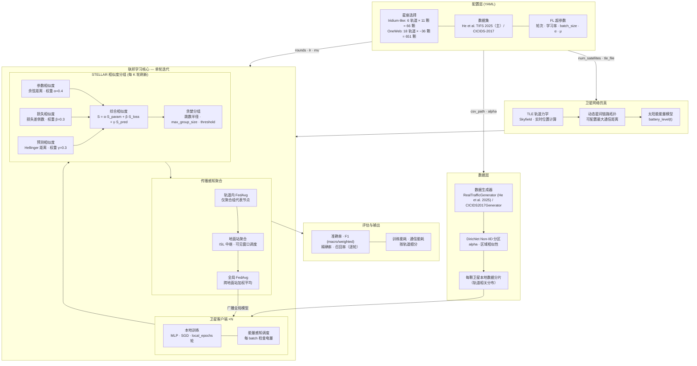

# STELLAR：面向恶意流量识别的相似度感知卫星联邦学习框架

> **发表于：** IEEE Transactions on Information Forensics and Security，第 21 卷，第 1766–1780 页，2026 年。
> DOI: [10.1109/TIFS.2026.3659044](https://doi.org/10.1109/TIFS.2026.3659044)

STELLAR 是一个面向低轨（LEO）卫星星座网络的联邦学习仿真框架，任务目标为**网络入侵检测（恶意流量分类）**。其核心贡献是**多维相似度感知分组策略**：通过综合模型参数相似度、损失曲线相似度和预测分布相似度，将卫星动态聚类为协作训练小组，同时兼顾星间链路的间歇性、卫星能量约束和通信拓扑的高动态性。

[[English README]](README.md)

---

## 系统架构



---

## 背景与动机

传统联邦学习算法（FedAvg、FedProx）面向地面网络设计，无法直接应用于卫星网络，原因包括：

- **星间链路间歇性**：卫星相对运动导致链路随时建立/断开
- **非均匀 Non-IID 数据分布**：不同轨道面覆盖区域差异显著
- **严格能量约束**：卫星依赖太阳能，电量受光照周期影响剧烈
- **高传播时延**：卫星与地面站之间通信窗口短暂且不可预测

STELLAR 的三项核心设计：

1. **相似度感知分组** — 三维综合相似度（参数 + 损失 + 预测分布）驱动卫星动态聚类
2. **传播受限聚合** — 模型更新仅在可达跳数范围内传播，遵守链路可用性约束
3. **能量感知调度** — 基于实时电量估计门控训练与传输

---

## 项目结构

```
stellar/
├── configs/                         # 实验配置文件（YAML）
│   ├── similarity_grouping_config.yaml  # STELLAR 算法配置
│   ├── fedavg_config.yaml               # FedAvg 基线配置
│   ├── fedprox_config.yaml              # FedProx 基线配置
│   ├── propagation_fedavg_config.yaml   # 传播受限 FedAvg 配置
│   ├── propagation_fedprox_config.yaml  # 传播受限 FedProx 配置
│   ├── sda_fl_config.yaml               # SDA-FL 基线配置
│   ├── oneweb_config.yaml               # OneWeb 大规模星座配置（651 颗）
│   ├── Iridium_TLEs.txt                 # Iridium NEXT TLE 轨道根数（66 颗）
│   ├── oneweb_TLEs.txt                  # OneWeb TLE 轨道根数（651 颗）
│   └── energy_config.yaml               # 卫星能量模型参数
│
├── data_simulator/                  # 数据集加载与 Non-IID 分区
│   ├── real_traffic_generator.py        # CSV 流量数据加载器（He et al. 2025 主数据集）
│   ├── cicids2017_generator.py          # CICIDS-2017 数据集加载器
│   ├── non_iid_generator.py             # Dirichlet Non-IID 数据分区
│   └── network_traffic_generator.py     # 合成流量数据生成器
│
├── fl_core/                         # 联邦学习核心组件
│   ├── client/
│   │   ├── satellite_client.py          # 卫星节点本地训练客户端
│   │   └── fedprox_client.py            # FedProx 近端项客户端
│   ├── aggregation/
│   │   ├── intra_orbit.py               # 轨道内聚合逻辑
│   │   ├── ground_station.py            # 地面站聚合
│   │   └── global_aggregator.py         # 全局模型聚合
│   └── models/
│       ├── real_traffic_model.py        # MLP 分类器（流量分类）
│       └── hybrid_traffic_model.py      # 混合自编码器 + 分类器模型
│
├── simulation/                      # 卫星网络仿真
│   ├── network_model.py                 # TLE 轨道力学与星间链路模型
│   ├── topology_manager.py              # 动态拓扑管理与谱聚类分组
│   ├── energy_model.py                  # 太阳能与电池仿真
│   ├── comm_scheduler.py                # 通信调度
│   └── network_manager.py              # 网络状态管理
│
├── experiments/                     # 实验运行脚本
│   ├── baseline_experiment.py           # 基础实验类（所有算法共用）
│   ├── grouping_experiment.py           # STELLAR（相似度分组）
│   ├── fedavg_experiment.py             # 标准 FedAvg
│   ├── fedprox_experiment.py            # 标准 FedProx
│   ├── propagation_fedavg_experiment.py # 传播受限 FedAvg
│   ├── propagation_fedprox_experiment.py# 传播受限 FedProx
│   ├── sda_fl_experiment.py             # SDA-FL（GAN 数据增强联邦学习）
│   ├── async_experiment.py              # 异步联邦学习变体
│   ├── run_fair_comparison_satfl.py     # 主对比实验脚本
│   ├── run_oneweb_comparison.py         # OneWeb 大规模星座实验
│   ├── run_ablation_study.py            # 消融实验
│   ├── run_robustness_study_v2.py       # 鲁棒性实验
│   ├── run_async_study.py               # 异步实验
│   └── run_theta_sweep.py               # 超参数扫描实验
│
├── visualization/                   # 可视化工具
│   ├── visualization.py                 # 训练曲线绘制
│   └── comparison_visualization.py      # 多算法对比绘图
│
├── tests/                           # 单元测试
├── data/                            # 数据集目录（见 data/README.md）
├── requirements.txt
└── setup.py
```

---

## 环境配置

**依赖环境：** Python 3.9+，PyTorch 1.13+

```bash
git clone https://github.com/lyb88999/STELLAR.git
cd STELLAR
pip install -r requirements.txt
```

或以开发模式安装为 Python 包：

```bash
pip install -e .
```

> **注意：** 首次运行时，Skyfield 会自动下载 `de421.bsp` 星历文件（约 16 MB）并缓存到本地，无需手动下载。

---

## 数据集准备

STELLAR 支持两个真实数据集，对应两种实验场景。如果您没有或者暂时无法下载这些数据集，可以用我们提供的脚本一键生成测试数据（ Dummy Data ）用于跑通代码流程。

### 🚀（推荐）一键生成测试数据集

首次克隆项目后，强烈建议先运行一次该脚本生成 `data/STIN.csv`。这将保证后续所有的命令可以直接运行而不会报错：

```bash
python scripts/generate_dummy_data.py
# 此命令将在 data/ 下生成包含 5000 条记录、10 个特征的虚拟数据集
```

### 主数据集 — 卫星-地面融合网络流量（He et al., TIFS 2025）

本文主实验所用数据集来源于以下论文：

> J. He, X. Li, X. Zhang, W. Niu and F. Li, "A Synthetic Data-Assisted Satellite Terrestrial Integrated Network Intrusion Detection Framework," *IEEE Transactions on Information Forensics and Security*, vol. 20, pp. 1739–1754, 2025. DOI: [10.1109/TIFS.2025.3530676](https://doi.org/10.1109/TIFS.2025.3530676)

我们下载了该工作发布的原始流量数据文件，经过特征选择、标签归一化、类别合并等预处理后，将多个文件**拼接为一个 CSV 文件**供实验使用。`RealTrafficGenerator` 通过配置中的 `csv_path` 参数直接加载该合并文件：

```yaml
data:
  dataset: "real_traffic"
  csv_path: "data/satellite_traffic.csv"   # He et al. (2025) 合并后的 CSV
```

CSV 文件需包含数值特征列与 `Label` 标签列（字符串类名或二值 0/1 均支持）。

### 辅助数据集 — CICIDS-2017

作为补充基准，STELLAR 同时支持加拿大新不伦瑞克大学发布的 CICIDS-2017 入侵检测数据集：

```
https://www.unb.ca/cic/datasets/ids-2017.html
```

下载后将 `MachineLearningCVE` 文件夹解压到 `data/` 目录：

```
data/MachineLearningCVE/
    Monday-WorkingHours.pcap_ISCX.csv
    Tuesday-WorkingHours.pcap_ISCX.csv
    Wednesday-workingHours.pcap_ISCX.csv
    Thursday-WorkingHours-Morning-WebAttacks.pcap_ISCX.csv
    Thursday-WorkingHours-Afternoon-Infilteration.pcap_ISCX.csv
    Friday-WorkingHours-Morning.pcap_ISCX.csv
    Friday-WorkingHours-Afternoon-DDos.pcap_ISCX.csv
    Friday-WorkingHours-Afternoon-PortScan.pcap_ISCX.csv
```

然后使用 `configs/cicids2017_config.yaml` 作为配置文件。

**数据集对照表：**

| 数据集 | 说明 | 配置方式 |
|---|---|---|
| He et al. TIFS 2025（主） | 卫星-地面融合网络流量，合并为单个 CSV | `real_traffic` + `csv_path` |
| CICIDS-2017 | 通用入侵检测基准数据集 | `cicids2017` |

---

## 快速开始

### 第一步：配置数据路径

编辑对应配置文件，将 `csv_path` 改为你的数据集路径：

```yaml
# configs/similarity_grouping_config.yaml
data:
  dataset: "real_traffic"
  csv_path: "data/traffic_data.csv"   # <-- 修改为实际路径
```

### 第二步：运行全量对比实验（STELLAR vs. 基线）

> **注意：** 实验轮次等超参数在配置文件（如 `configs/similarity_grouping_config.yaml`）中通过 `fl.num_rounds` 字段设置，**不通过命令行参数传入**。

```bash
# 直接运行（轮次等参数在配置文件中设置）
python -m experiments.run_fair_comparison_satfl
```

实验结果会自动保存至 `comparison_results/with_satfl_<时间戳>/` 目录。

**可用命令行参数：**

| 参数 | 默认值 | 说明 |
|---|---|---|
| `--target-sats` | `0` | 目标卫星数量（0 表示使用 STELLAR 的平均值） |
| `--fedprox-mu` | `0.01` | FedProx 近端项系数 μ |
| `--config-dir` | `configs` | 配置文件目录 |
| `--satfl-noise-dim` | `100` | SDA-FL 噪声维度 |
| `--satfl-samples` | `1000` | SDA-FL 生成的合成样本数 |
| `--replot` | — | 重新绘图模式（不重跑实验，仅重绘已有数据） |
| `--data-dir` | — | 已有实验数据目录（配合 `--replot` 使用） |
| `--output-dir` | — | 图表输出目录（配合 `--replot` 使用） |
| `--format` | `png` | 图表格式：`png` / `pdf` / `svg` / `jpg` |
| `--dpi` | `150` | 图表 DPI |
| `--no-grid` | — | 不显示网格线 |

**使用示例：**

```bash
# 自定义 FedProx μ 参数运行
python -m experiments.run_fair_comparison_satfl --fedprox-mu 0.001

# 利用已有实验结果重新绘图（无需重跑实验）
python -m experiments.run_fair_comparison_satfl \
    --replot \
    --data-dir comparison_results/with_satfl_20260315_153000 \
    --output-dir my_plots/ \
    --format pdf
```

### 第三步：单独运行某个算法

```bash
# STELLAR（本文提出的方法）
python -c "
from experiments.grouping_experiment import SimilarityGroupingExperiment
exp = SimilarityGroupingExperiment('configs/similarity_grouping_config.yaml')
exp.prepare_data()
exp.setup_clients()
stats = exp.train()
"

# FedAvg 基线
python -c "
from experiments.fedavg_experiment import FedAvgExperiment
exp = FedAvgExperiment('configs/fedavg_config.yaml')
exp.prepare_data()
exp.setup_clients()
stats = exp.train()
"

# FedProx 基线
python -c "
from experiments.fedprox_experiment import FedProxExperiment
exp = FedProxExperiment('configs/fedprox_config.yaml')
exp.prepare_data()
exp.setup_clients()
stats = exp.train()
"

# SDA-FL 基线
python -c "
from experiments.sda_fl_experiment import SDAFLExperiment
exp = SDAFLExperiment('configs/sda_fl_config.yaml')
exp.prepare_data()
exp.setup_clients()
stats = exp.train()
"
```

### 切换到 OneWeb 大规模星座（651 颗卫星）

```bash
python -c "
from experiments.grouping_experiment import SimilarityGroupingExperiment
exp = SimilarityGroupingExperiment('configs/oneweb_config.yaml')
exp.prepare_data()
exp.setup_clients()
stats = exp.train()
"
```

---

## 配置参数说明

> **注意：** 框架会根据 TLE 文件自动检测实际卫星数量、轨道数和每轨道卫星数，并覆盖 `fl.num_satellites`、`fl.num_orbits`、`fl.satellites_per_orbit` 的配置值。

### 通用参数（所有实验共用）

```yaml
fl:
  num_satellites: 66          # 卫星总数（会被 TLE 自动检测值覆盖）
  num_orbits: 6               # 轨道面数量（会被 TLE 自动检测值覆盖）
  satellites_per_orbit: 11    # 每轨道卫星数（会被 TLE 自动检测值覆盖）
  num_rounds: 20              # 联邦学习通信总轮次
  round_interval: 600         # 每轮仿真时间间隔（秒）

network:
  tle_file: "configs/Iridium_TLEs.txt"  # TLE 轨道根数文件（决定星座构型）
  max_distance: 4000.0                   # 最大星间通信距离（km）

data:
  dataset: "real_traffic"     # 数据集类型：real_traffic | cicids2017
  csv_path: "data/STIN.csv"   # CSV 数据文件路径
  iid: false                  # true = IID 分布；false = Non-IID（Dirichlet 分区）
  alpha: 0.5                  # Dirichlet 参数，越小数据异构性越强（仅 non-IID 时生效）
  test_size: 0.2              # 测试集比例
  region_similarity: false    # 是否启用轨道区域相似性数据分区
  overlap_ratio: 0.5          # 区域重叠比例（仅 region_similarity: true 时生效）

model:
  type: "traffic_classifier"  # 模型类型：traffic_classifier | hybrid_traffic_classifier
  hidden_dim: 64              # 隐藏层维度

client:
  batch_size: 32              # 本地训练批次大小
  local_epochs: 5             # 每轮本地训练轮数
  learning_rate: 0.01         # 本地训练学习率
  momentum: 0.9               # SGD 动量系数
  compute_capacity: 1.0       # 计算能力系数（预留，当前未影响训练）
  storage_capacity: 1000.0    # 存储容量（MB，预留）

aggregation:
  min_updates: 2              # 触发聚合所需的最少卫星更新数
  max_staleness: 300.0        # 允许的最大模型陈旧度（秒）
  timeout: 600.0              # 聚合等待超时时间（秒）
  weighted_average: true      # 是否按样本数量加权聚合

energy:
  config_file: "configs/energy_config.yaml"  # 能量模型配置文件路径
```

### STELLAR 专属参数

```yaml
group:
  max_distance: 2              # 相似度搜索半径（跳数，使用 Iridium；km，使用 OneWeb）
  max_group_size: 5            # 每个分组的最大卫星数
  max_group_size_threshold: 4  # 超过此大小时触发相似度门限自动调整
  similarity_threshold: 0.5    # 加入分组所需的最低综合相似度分数
  similarity_refresh_rounds: 5 # 每隔 N 轮重新计算分组
  initial_group_size: 1        # 初始阶段每个卫星自成一组（冷启动）
  weights:
    alpha: 0.4                 # 模型参数余弦相似度权重
    beta: 0.3                  # 损失曲线相似度权重
    gamma: 0.3                 # 预测分布 Hellinger 距离权重
```

### FedProx 专属参数

```yaml
fedprox:
  mu: 0.01    # 近端项系数 μ，控制本地模型偏离全局模型的惩罚强度
```

### 传播受限聚合参数（Prop-FedAvg / Prop-FedProx / SDA-FL）

```yaml
propagation:
  hops: 2                    # 模型更新最大传播跳数
  max_satellites: 648        # 传播范围内最大参与卫星数
  intra_orbit_links: true    # 是否允许轨道内 ISL
  inter_orbit_links: true    # 是否允许跨轨道 ISL
  link_reliability: 0.95     # ISL 链路可靠性概率
  energy_per_hop: 0.05       # 每跳通信能耗（Wh）
  # propagation_delay: 10    # 每跳传播时延（ms）— 配置文件中存在但代码未读取
```

### SDA-FL 专属参数

```yaml
sda_fl:
  noise_dim: 100             # GAN 生成器输入噪声向量维度
  num_synthetic_samples: 1000  # 每轮生成的合成样本总数
  gan_samples_per_client: 100  # 每个客户端分配到的合成样本数
  gan_epochs: 50             # 每轮 GAN 训练迭代次数
  initial_rounds: 3          # GAN 训练启动前的热身轮数（纯 FL 阶段）
  regenerate_interval: 5     # 每隔 N 轮重新训练 GAN
  pseudo_threshold: 0.8      # 伪标签置信度阈值
  dp_epsilon: 1.0            # 差分隐私 ε 参数（越小隐私保护越强）
  dp_delta: 1.0e-05          # 差分隐私 δ 参数
```

### 执行参数

```yaml
execution:
  max_workers: 8             # 并行线程数（仅 SDA-FL 读取）
  random_seed: 42            # 随机种子（配置文件中存在但代码未读取）
  log_level: "INFO"          # 日志级别（配置文件中存在但代码未读取）
```

### 鲁棒性测试参数

```yaml
robustness:
  parameter_noise_level: 0.1  # 参数扰动噪声强度（0.0 表示禁用）
  noise_start_round: 5        # 从第几轮开始注入噪声
```

### ⚠️ 配置文件中存在但当前代码未读取的参数

| 参数 | 所在块 | 说明 |
|---|---|---|
| `ground_station.*` | `ground_station` | 地面站带宽、存储等参数在代码中被硬编码，配置值被忽略 |
| `early_stopping.*` | `early_stopping` | 早停逻辑未在当前实验中实现 |
| `fedavg.participation_rate` | `fedavg` | 全量参与，该参数未生效 |
| `execution.random_seed` | `execution` | 未设置全局随机种子 |
| `execution.log_level` | `execution` | 日志级别在代码中固定为 INFO |
| `propagation.propagation_delay` | `propagation` | 字段存在于配置，但代码未读取 |

---

## 支持的算法

| 算法 | 实验类 | 配置文件 | 说明 |
|---|---|---|---|
| **STELLAR** | `SimilarityGroupingExperiment` | `similarity_grouping_config.yaml` | 本文提出：相似度感知分组联邦学习 |
| FedAvg | `FedAvgExperiment` | `fedavg_config.yaml` | McMahan et al. (2017) |
| FedProx | `FedProxExperiment` | `fedprox_config.yaml` | Li et al. (2020)，加近端项约束 |
| Prop-FedAvg | `LimitedPropagationFedAvg` | `propagation_fedavg_config.yaml` | FedAvg + 跳数受限传播 |
| Prop-FedProx | `LimitedPropagationFedProx` | `propagation_fedprox_config.yaml` | FedProx + 跳数受限传播 |
| SDA-FL | `SDAFLExperiment` | `sda_fl_config.yaml` | 基于 GAN 的合成数据增强联邦学习 |

---

## 进阶实验

### 消融实验

评估各相似度维度对 STELLAR 性能的贡献：

```bash
python -m experiments.run_ablation_study
```

### 鲁棒性实验

测试在参数传输噪声下的性能退化：

```bash
python -m experiments.run_robustness_study_v2
```

### 超参数灵敏度分析

扫描 `alpha`、`beta`、`gamma` 权重组合对性能的影响：

```bash
python -m experiments.run_theta_sweep
```

### 异步联邦学习实验

```bash
python -m experiments.run_async_study
```

### OneWeb 大规模对比实验

在 651 颗卫星的 OneWeb 星座上运行对比：

```bash
python -m experiments.run_oneweb_comparison
```

---

## 运行测试

```bash
pytest tests/ -v
```

---

## 引用

如果本代码对你的研究有帮助，请引用我们的论文：

```bibtex
@article{li2026stellar,
  author  = {Li, Yubo and Zhang, Li and Li, Kai and Su, Haoru},
  journal = {IEEE Transactions on Information Forensics and Security},
  title   = {STELLAR: Similarity-Based Satellite Federated Learning for Malicious Traffic Recognition},
  year    = {2026},
  volume  = {21},
  pages   = {1766--1780},
  doi     = {10.1109/TIFS.2026.3659044}
}
```

---

## 许可证

本项目基于 MIT 许可证开源，详见 [LICENSE](LICENSE)。
